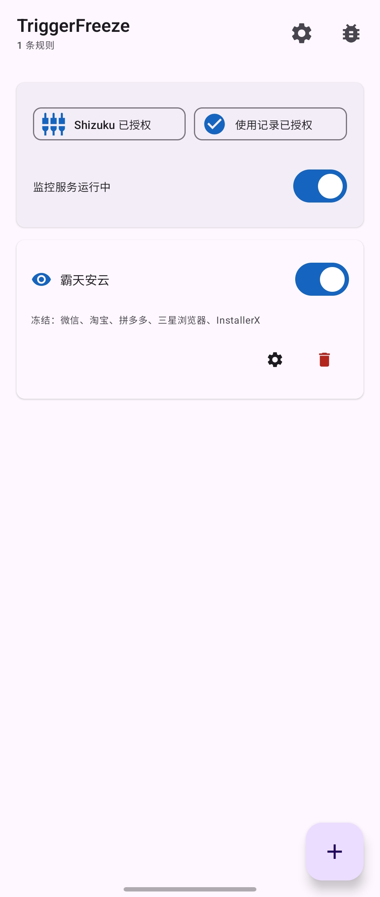
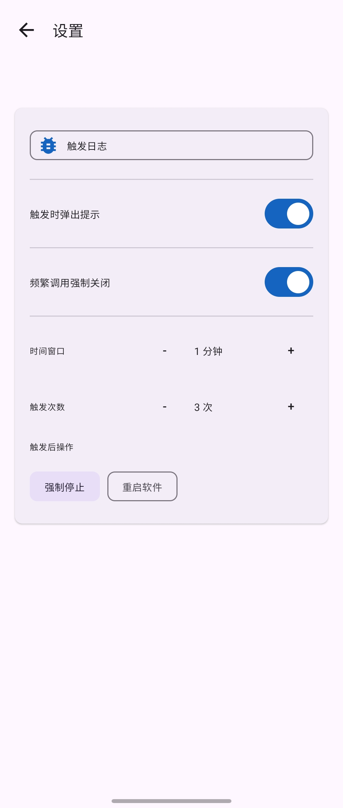
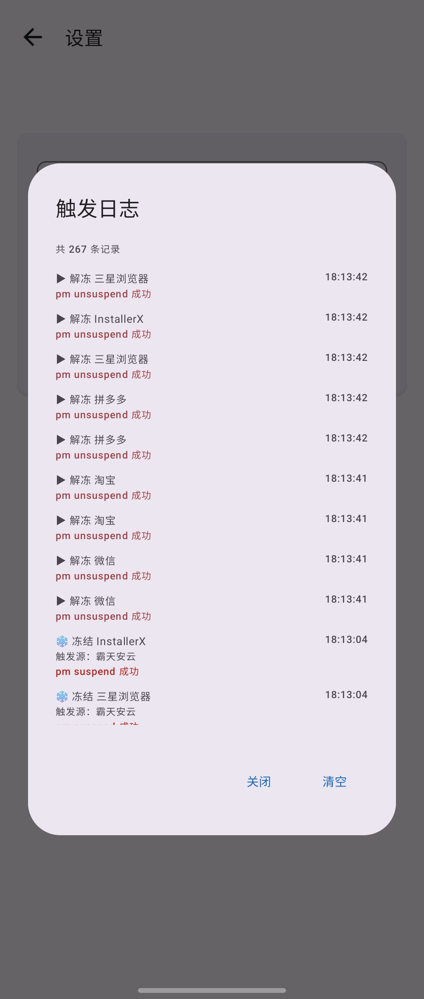
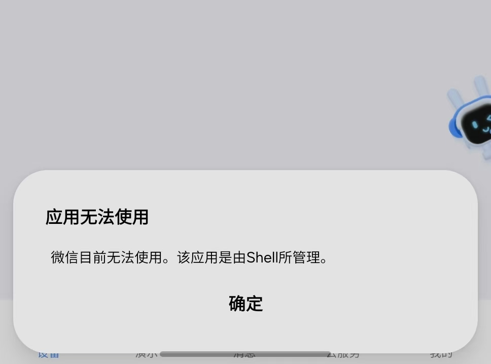

<div align="center">
  <h1>❄️ TriggerFreeze</h1>
  <p><strong>基于规则的前台应用感知冻结工具 · 智能屏蔽跳转</strong></p>
  <p>
    
    
    
    
    
  </p>
</div>

---

## 📖 简介

**TriggerFreeze** 是一款 Android 工具类应用，通过监控前台应用变化，自动冻结/解冻目标应用。主要用于拦截广告跳转——当某个应用（如广告 App）被切换到前台时，自动冻结你指定的目标应用（如购物 App），阻止其被拉起。当离开触发应用后，目标应用会自动解冻，恢复正常使用。

### 核心特性

| 特性 | 说明 |
|------|------|
| 🎯 **规则驱动** | 设置"当 A 在前台时，冻结 B"，一对多灵活配置 |
| ⚡ **实时监控** | 基于 `UsageStatsManager` 检测前台变化，1.5 秒轮询 |
| 🔒 **Shizuku 加持** | 通过 Shizuku API 执行系统命令，无需 Root |
| 🛡️ **防穿检测** | 每次轮询都重新冻结，消除因状态偏移导致的漏冻结 |
| ⏱ **延迟解冻** | 离开触发应用后延迟 5 秒解冻，防止快速切回绕过 |
| 🚫 **频繁调用防护** | 检测恶意 App 高频调用外部程序，自动强制停止或重启 |
| 🧩 **现代 UI** | Jetpack Compose + Material3 构建，流畅体验 |

---

## ✨ 功能总览

<details>
<summary><strong>📋 规则管理</strong></summary>

- 添加/编辑/删除/启用/禁用冻结规则
- 触发应用选择（单选）
- 目标应用选择（多选）
- 应用图标显示、名称搜索、系统应用筛选
- 首次加载后缓存，秒开体验，后台异步刷新
</details>

<details>
<summary><strong>🔒 冻结机制</strong></summary>

- 通过 Shizuku 调用 `pm suspend` 挂起目标应用
- 每次轮询幂等执行，保证状态一致性
- 离开触发应用 5 秒延迟解冻
- 服务启动时同步系统已挂起状态到本地缓存
- 服务停止时自动解冻所有应用
</details>

<details>
<summary><strong>🚫 频繁调用防护</strong></summary>

- 通过 Shizuku 读取 `logcat` 系统拦截日志，统计被挂起应用的调用尝试次数
- 可配置时间窗口（1~10 分钟）和触发次数阈值（3~100 次）
- **超过阈值后的处置方式：**
  - **强制停止** — 执行 `am force-stop` 杀死应用
  - **重启软件** — 先强制停止，再通过 `monkey -p` 重新启动应用
</details>

<details>
<summary><strong>📝 触发日志</strong></summary>

- 记录每次规则触发、冻结、解冻、错误事件
- 时间、触发源、目标包、操作结果一目了然
- 保留最近 500 条，支持查看和清空
</details>

<details>
<summary><strong>🎨 用户体验</strong></summary>

- 双击返回键退出（防误触）
- 二级界面单次返回回到首页
- 触发时 Toast 提示（可关闭）
- 内置崩溃捕获 + 错误日志查看器
- 跟随系统暗色模式
</details>

---

## 📸 截图

| 首页 | 设置页面 | 触发日志 | 拦截效果 |
|:---:|:---:|:---:|:---:|
|  |  |  |  |

---

## 🔧 工作原理

```
┌──────────────────────────────────────────────────────────────┐
│                   ForegroundMonitorService                    │
│                     (前台服务 · 1.5s 轮询)                    │
├──────────────────────────────────────────────────────────────┤
│                                                              │
│  ① UsageStatsManager 查询当前前台应用包名                     │
│          │                                                   │
│          ▼                                                   │
│  ② 匹配规则 → 找到匹配的触发应用                              │
│          │                                                   │
│          ▼                                                   │
│  ③ pm suspend <目标包> (通过 Shizuku)                        │
│          │                                                   │
│          ▼                                                   │
│  ④ 目标应用被系统挂起 → 所有启动 Intent 被拦截               │
│          │                                                   │
│          ▼                                                   │
│  ⑤ 系统日志输出 Forbidding suspended package                 │
│          │                                                   │
│          ▼                                                   │
│  ⑥ logcat 流式监听 → 拦截计数 → 滑动窗口判定                 │
│          │                                                   │
│          ▼                                                   │
│  ⑦ 超阈值 → am force-stop / monkey -p 重启                   │
│                                                              │
│  离开触发应用 → 延迟 5s → pm unsuspend 解冻                   │
└──────────────────────────────────────────────────────────────┘
```

### 技术栈

| 层面 | 技术 |
|------|------|
| UI | Jetpack Compose + Material 3 |
| 生命周期 | Compose Lifecycle + Coroutine |
| IPC 命令 | Shizuku API |
| 持久化 | SharedPreferences + JSON |
| 前台检测 | `UsageStatsManager.queryEvents()` |
| 拦截检测 | `logcat --regex` 流式过滤（通过 Shizuku） |

### 权限说明

| 权限 | 用途 | 说明 |
|------|------|------|
| **使用情况访问权限** | 读取前台应用包名 | 需用户在系统设置中手动授权 |
| **Shizuku 权限** | 执行 Shell 命令 | 需安装 Shizuku Manager |
| **通知权限** | 前台服务通知 | Android 13+ 需动态申请 |

---

## 🚀 快速开始

### 环境要求

- Android 8.0 (API 26) 或更高
- [Shizuku Manager](https://shizuku.rikka.app/) 已安装并运行
- 已授予「使用情况访问权限」

### 从源码构建

```bash
# 克隆仓库
git clone https://github.com/yourusername/TriggerFreeze.git
cd TriggerFreeze

# 构建 Debug APK
./gradlew assembleDebug

# 安装
adb install app/build/outputs/apk/debug/app-debug.apk
```

或在 Android Studio 中直接打开项目，点击 **Run** 即可。

### 首次使用

1. 安装 [Shizuku Manager](https://shizuku.rikka.app/) 并启动（无线调试或 ADB 方式）
2. 打开 TriggerFreeze，点击「Shizuku」状态栏进行授权
3. 授权「使用情况访问权限」
   - 系统设置 → 应用 → 特殊权限 → 使用情况访问权限
   - 找到 TriggerFreeze 并开启
4. 点击右下角 **+** 添加规则
5. 回到首页顶部开启**监控服务**
6. 正常使用即可

---

## 📱 使用指南

### 添加规则

```
① 点击右下角 [+] 按钮
② 在列表中选择"触发应用"（如某广告 App）
③ 点击 [下一步]
④ 勾选"被冻结的应用"（如购物 App，可多选）
⑤ 点击 [保存规则]
```

### 管理规则

| 操作 | 方式 |
|------|------|
| 启用/禁用 | 点击规则右侧开关 |
| 编辑冻结列表 | 点击规则上的 ⚙️ 图标（需先开启规则） |
| 删除规则 | 点击规则上的 🗑️ 图标 |
| 刷新列表 | 首页右上角 🔄 按钮 |

### 设置项

首页右上角 ⚙️ 进入设置：

| 设置项 | 默认值 | 说明 |
|--------|--------|------|
| 触发日志 | - | 查看所有触发/冻结/解冻的历史记录 |
| 触发时弹出提示 | 开启 | 规则触发时显示底部 Toast |
| 频繁调用强制关闭 | 关闭 | 开启后检测高频拦截行为 |
| ├ 时间窗口 | 1 分钟 | 统计拦截次数的时间范围 |
| ├ 触发次数 | 10 次 | 触发自动处置的阈值 |
| └ 触发后操作 | 强制停止 | 强制停止 / 重启软件 |

---

## 🛠️ 项目结构

```
TriggerFreeze/
├── app/
│   ├── src/main/java/com/example/triggerfreeze/
│   │   ├── ForegroundMonitorService.kt   # 前台监控服务（核心）
│   │   ├── FreezeManager.kt              # 冻结操作管理
│   │   ├── ShizukuExecutor.kt            # Shizuku 命令执行
│   │   ├── MainActivity.kt               # 主界面 + 导航
│   │   ├── PreferencesManager.kt         # 设置持久化
│   │   ├── TriggerLogger.kt              # 触发日志管理器
│   │   ├── AppListCache.kt               # 应用列表缓存
│   │   ├── CrashReporter.kt              # 崩溃捕获
│   │   ├── TriggerFreezeApp.kt           # Application 入口
│   │   ├── model/Models.kt               # 数据模型
│   │   └── ui/theme/                     # Compose 主题
│   ├── src/main/AndroidManifest.xml
│   └── build.gradle.kts
├── gradle/libs.versions.toml             # 版本目录
├── build.gradle.kts                      # 项目级构建
├── settings.gradle.kts
└── README.md
```

---

## ⚠️ 注意事项

| 注意点 | 详情 |
|--------|------|
| **Shizuku 必须运行** | 所有冻结/解冻和强制停止命令均通过 Shizuku 执行，Shizuku Manager 停止工作后本 App 将无法操作 |
| **使用情况权限** | 若未授权，前台监控无法获取当前应用信息 |
| **服务停止自动解冻** | 停止监控服务后，所有被冻结的应用会自动解冻 |
| **频繁调用防护** | `logcat` 检测依赖系统日志输出，不同厂商 ROM 可能存在差异 |
| **应用图标** | 首次安装后图标需要后台刷新才会显示（缓存只存文字信息） |

---

## 🙏 致谢

- [Shizuku](https://github.com/RikkaApps/Shizuku) — 提供普通应用调用系统 API 的能力
- [Jetpack Compose](https://developer.android.com/compose) — 现代化 Android UI 工具包
- [Material Design 3](https://m3.material.io/) — 设计语言和组件库
- [NoShake](https://gitee.com/xiao-lus-studio_0/no-shake) — 本项目的灵感来源，一个优秀的跳转拦截工具

---

## 📄 License

```
MIT License

Copyright (c) 2026 TriggerFreeze

Permission is hereby granted, free of charge, to any person obtaining a copy
of this software and associated documentation files (the "Software"), to deal
in the Software without restriction, including without limitation the rights
to use, copy, modify, merge, publish, distribute, sublicense, and/or sell
copies of the Software, and to permit persons to whom the Software is
furnished to do so, subject to the following conditions:

The above copyright notice and this permission notice shall be included in all
copies or substantial portions of the Software.

THE SOFTWARE IS PROVIDED "AS IS", WITHOUT WARRANTY OF ANY KIND, EXPRESS OR
IMPLIED, INCLUDING BUT NOT LIMITED TO THE WARRANTIES OF MERCHANTABILITY,
FITNESS FOR A PARTICULAR PURPOSE AND NONINFRINGEMENT. IN NO EVENT SHALL THE
AUTHORS OR COPYRIGHT HOLDERS BE LIABLE FOR ANY CLAIM, DAMAGES OR OTHER
LIABILITY, WHETHER IN AN ACTION OF CONTRACT, TORT OR OTHERWISE, ARISING FROM,
OUT OF OR IN CONNECTION WITH THE SOFTWARE OR THE USE OR OTHER DEALINGS IN THE
SOFTWARE.
```
